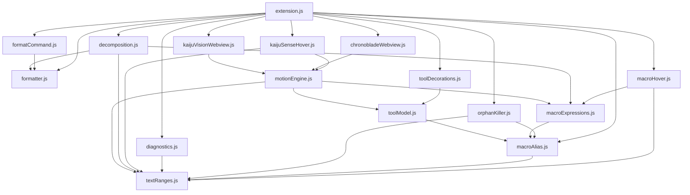
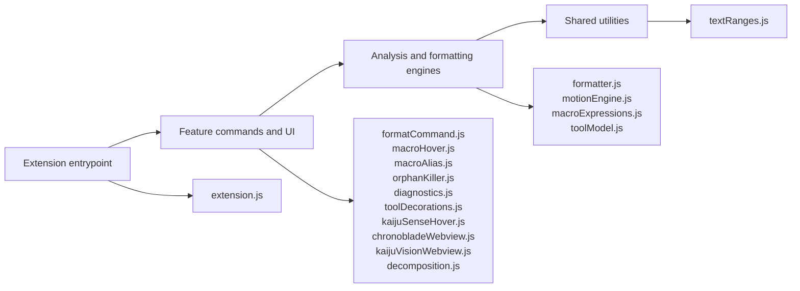

# KAIJU.NC Module Dependencies

This chart shows local CommonJS `require("./...")` dependencies in `src/`.
External modules such as `vscode` and Node built-ins such as `path` are omitted.

## Layered View

## Notes

- `extension.js` wires all VS Code registrations together.
- `motionEngine.js` is the shared motion-analysis core for Sense, Vision, and Chronoblade.
- `formatter.js` is shared by Reconstructor and Decomposition output formatting.
- `macroExpressions.js` centralizes macro alias/value resolution for expression-aware features.
- `toolModel.js` owns the tool color palette and tool ranges; `toolDecorations.js` renders gutter markers from it and Vision reuses it for optional tool-colored paths.
- `textRanges.js` is the low-level comment/angle-bracket range helper used across diagnostics, aliasing, hovers, formatting-adjacent logic, and decomposition.
