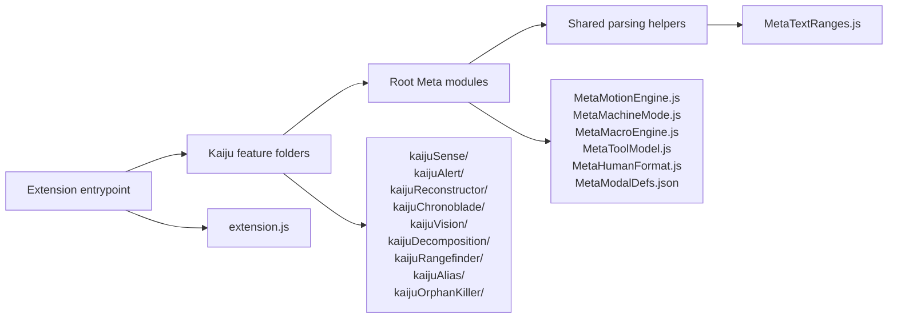

# KAIJU.NC Module Dependencies

This chart shows local CommonJS dependencies in `src/`.
External modules such as `vscode` and Node built-ins such as `path` are omitted.

```mermaid
flowchart TD
	extension[extension.js]

	extension --> reconFormatter[kaijuReconstructor/formatter.js]
	extension --> reconCommand[kaijuReconstructor/command.js]
	extension --> sense[kaijuSense/index.js]
	extension --> alias[kaijuAlias/index.js]
	extension --> orphan[kaijuOrphanKiller/index.js]
	extension --> alert[kaijuAlert/diagnostics.js]
	extension --> chronoblade[kaijuChronoblade/webview.js]
	extension --> vision[kaijuVision/webview.js]
	extension --> decomposition[kaijuDecomposition/index.js]
	extension --> machine[MetaMachineMode.js]
	extension --> rangefinder[kaijuRangefinder/index.js]

	reconCommand --> reconFormatter
	reconCommand --> reconOptions[kaijuReconstructor/options.js]
	reconOptions --> reconFormatter

	sense --> senseMacro[kaijuSense/macro.js]
	sense --> senseTool[kaijuSense/tool.js]
	sense --> senseLabels[kaijuSense/nLabels.js]
	sense --> senseHover[kaijuSense/hover.js]
	sense --> senseStatus[kaijuSense/statusBar.js]
	sense --> senseFork[kaijuSense/fork.js]
	senseMacro --> text[MetaTextRanges.js]
	senseMacro --> macro[MetaMacroEngine.js]
	senseTool --> tool[MetaToolModel.js]
	senseLabels --> text
	senseHover --> text
	senseHover --> motion[MetaMotionEngine.js]
	senseStatus --> motion
	senseStatus --> senseOptions[kaijuSense/options.js]
	senseOptions --> machine
	senseFork --> text

	alert --> text
	alert --> alertOptions[kaijuAlert/options.js]

	alias --> text
	alias --> aliasOptions[kaijuAlias/options.js]

	orphan --> text
	orphan --> macro
	orphan --> orphanOptions[kaijuOrphanKiller/options.js]

	rangefinder --> tool
	rangefinder --> text

	chronoblade --> motion
	chronoblade --> chronobladeOptions[kaijuChronoblade/options.js]
	chronobladeOptions --> machine

	vision --> motion
	vision --> visionOptions[kaijuVision/options.js]
	visionOptions --> machine

	decomposition --> text
	decomposition --> macro
	decomposition --> reconFormatter
	decomposition --> decompositionOptions[kaijuDecomposition/options.js]

	motion --> text
	motion --> macro
	motion --> tool
	motion --> humanFormat[MetaHumanFormat.js]
	motion --> modalDefs[MetaModalDefs.json]
	macro --> text
	tool --> macro
```

## Layered View

## Notes

- `extension.js` wires feature folders and root meta modules together.
- Feature folders own commands, hovers, webviews, diagnostics, status bars, and their `options.js` files.
- Root `Meta...` modules are shared infrastructure, not user-facing feature surfaces.
- `MetaMotionEngine.js` is the shared motion/modal interpreter for Sense, Vision, and Chronoblade.
- `MetaHumanFormat.js` formats raw numbers for human-facing UI only; it must not be used as a calculation step.
- `MetaMacroEngine.js` centralizes macro alias parsing and macro expression/value resolution for expression-aware features.
- `MetaToolModel.js` owns tool colors and tool ranges; Sense and Rangefinder consume it.
- `MetaTextRanges.js` is the low-level comment/angle-bracket helper used across features.
