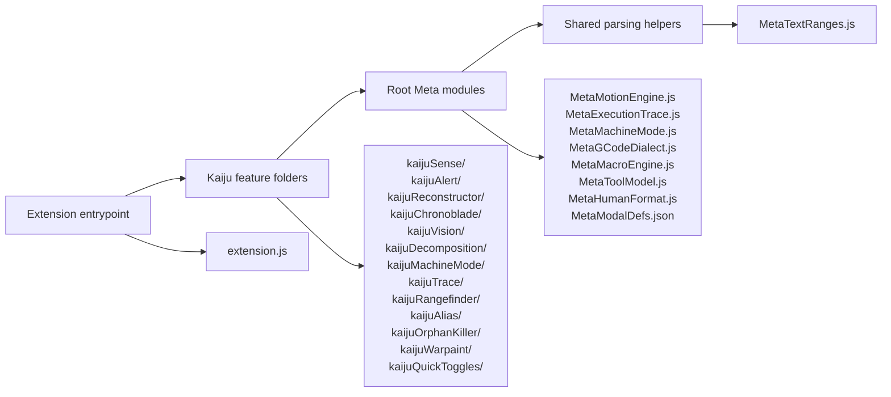

# KAIJU.NC Module Dependencies

This chart shows local CommonJS dependencies in `src/`.
External modules such as `vscode` and Node built-ins such as `path` are omitted.

```mermaid
flowchart TD
	extension[extension.js]

	extension --> reconFormatter[kaijuReconstructor/formatter.js]
	extension --> reconCommand[kaijuReconstructor/command.js]
	extension --> sense[kaijuSense/index.js]
	extension --> alias[kaijuAlias/index.js]
	extension --> orphan[kaijuOrphanKiller/index.js]
	extension --> alert[kaijuAlert/diagnostics.js]
	extension --> chronoblade[kaijuChronoblade/webview.js]
	extension --> vision[kaijuVision/webview.js]
	extension --> decomposition[kaijuDecomposition/index.js]
	extension --> machineFeature[kaijuMachineMode/index.js]
	extension --> traceFeature[kaijuTrace/index.js]
	extension --> rangefinder[kaijuRangefinder/index.js]
	extension --> warpaint[kaijuWarpaint/index.js]
	extension --> quickToggles[kaijuQuickToggles/index.js]

	reconCommand --> reconFormatter
	reconCommand --> reconOptions[kaijuReconstructor/options.js]
	reconOptions --> reconFormatter
	reconFormatter --> text[MetaTextRanges.js]

	sense --> senseMacro[kaijuSense/macro.js]
	sense --> senseTool[kaijuSense/tool.js]
	sense --> senseLabels[kaijuSense/nLabels.js]
	sense --> senseHover[kaijuSense/hover.js]
	sense --> senseStatus[kaijuSense/statusBar.js]
	sense --> senseFork[kaijuSense/fork.js]
	senseMacro --> text[MetaTextRanges.js]
	senseMacro --> macro[MetaMacroEngine.js]
	senseTool --> tool[MetaToolModel.js]
	senseLabels --> text
	senseHover --> text
	senseHover --> motion[MetaMotionEngine.js]
	senseStatus --> motion
	senseStatus --> machine
	senseStatus --> senseOptions[kaijuSense/options.js]
	senseOptions --> machine
	senseFork --> text

	alert --> text
	alert --> machine
	alert --> alertOptions[kaijuAlert/options.js]

	alias --> text
	alias --> aliasOptions[kaijuAlias/options.js]

	orphan --> text
	orphan --> macro
	orphan --> orphanOptions[kaijuOrphanKiller/options.js]

	rangefinder --> tool
	rangefinder --> text
	warpaint --> tool
	warpaint --> rangefinder
	warpaint --> warpaintOptions[kaijuWarpaint/options.js]

	chronoblade --> motion
	chronoblade --> trace[MetaExecutionTrace.js]
	chronoblade --> decomposition
	chronoblade --> chronobladeOptions[kaijuChronoblade/options.js]
	chronoblade --> machine
	chronobladeOptions --> machine

	vision --> motion
	vision --> trace
	vision --> decomposition
	vision --> visionOptions[kaijuVision/options.js]
	vision --> machine
	vision --> macro
	vision --> text
	visionOptions --> machine

	decomposition --> text
	decomposition --> macro
	decomposition --> trace
	decomposition --> reconFormatter
	decomposition --> decompositionOptions[kaijuDecomposition/options.js]

	traceFeature --> traceStatus[kaijuTrace/statusBar.js]
	traceStatus --> trace

	machineFeature --> machine
	machineFeature --> dialect
	machineFeature --> profileEditor[kaijuMachineMode/profileEditor.js]
	machineFeature --> alias
	machineFeature --> aliasOptions[kaijuAlias/options.js]
	profileEditor --> dialect
	profileEditor --> machine

	motion --> text
	motion --> macro
	motion --> tool
	motion --> humanFormat[MetaHumanFormat.js]
	motion --> modalDefs[MetaModalDefs.json]
	motion --> dialect[MetaGCodeDialect.js]
	machine --> dialect
	trace --> text
	trace --> macro
	macro --> text
	tool --> macro
	tool --> text
```

## Layered View

```mermaid
flowchart LR
	entry[Extension entrypoint] --> features[Kaiju feature folders]
	features --> meta[Root Meta modules]
	meta --> utility[Shared parsing helpers]

	entryModules["extension.js"]
	featureModules["kaijuSense/<br/>kaijuAlert/<br/>kaijuReconstructor/<br/>kaijuChronoblade/<br/>kaijuVision/<br/>kaijuDecomposition/<br/>kaijuMachineMode/<br/>kaijuTrace/<br/>kaijuRangefinder/<br/>kaijuAlias/<br/>kaijuOrphanKiller/<br/>kaijuWarpaint/<br/>kaijuQuickToggles/"]
	metaModules["MetaMotionEngine.js<br/>MetaExecutionTrace.js<br/>MetaMachineMode.js<br/>MetaGCodeDialect.js<br/>MetaMacroEngine.js<br/>MetaToolModel.js<br/>MetaHumanFormat.js<br/>MetaModalDefs.json"]
	utilityModules["MetaTextRanges.js"]

	entry --> entryModules
	features --> featureModules
	meta --> metaModules
	utility --> utilityModules
```

## Notes

- `extension.js` wires feature folders and root meta modules together.
- Feature folders own commands, hovers, webviews, diagnostics, status bars, and their `options.js` files.
- Root `Meta...` modules are shared infrastructure, not user-facing feature surfaces.
- `MetaMotionEngine.js` is the shared motion/modal interpreter for Sense, Vision, and Chronoblade.
- `MetaGCodeDialect.js` maps profile-specific G-code patterns to stable shared
  motion/modal operations before `MetaMotionEngine.js` applies them. Every
  profile exposes independent mill and lathe keybinding tables with explicit
  unbound operation slots. `kaijuMachineMode/profileEditor.js` owns the
  Settings-backed custom-profile table editor; Meta validates and exposes the
  resulting profiles to all consumers.
- `MetaExecutionTrace.js` owns execution-order data and shared Trace-output mapping for Vision and Chronoblade.
- `kaijuDecomposition` formats `MetaExecutionTrace` occurrences; it does not
  execute a second control-flow pass.
- `MetaHumanFormat.js` formats raw numbers for human-facing UI only; it must not be used as a calculation step.
- `MetaMacroEngine.js` centralizes macro alias parsing and macro expression/value resolution for expression-aware features.
- `MetaToolModel.js` owns tool colors and tool ranges; Sense and Rangefinder consume it.
- `MetaTextRanges.js` is the low-level comment/angle-bracket helper used across features.
- `MetaMachineMode.js` owns shared profile state; `kaijuMachineMode/` owns its
  commands, notifications, and right-side status presentation.
