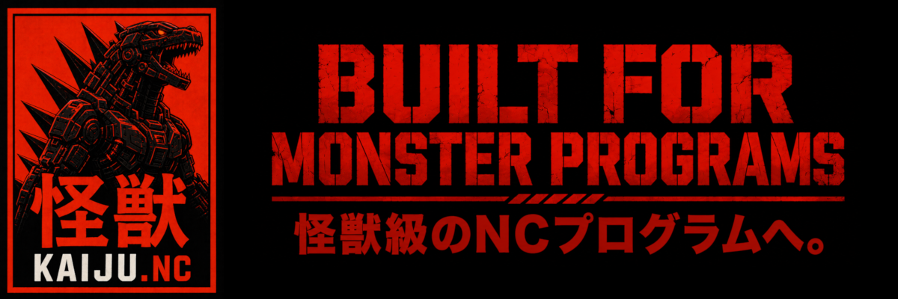
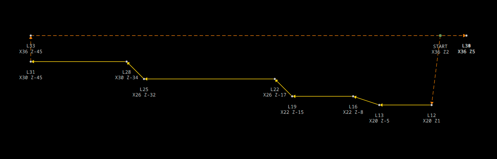
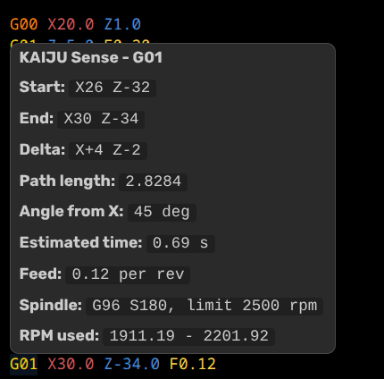
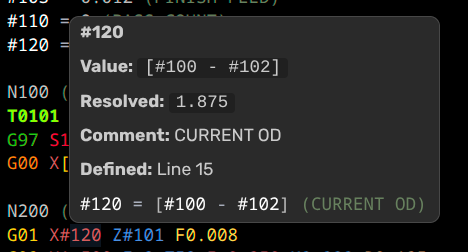
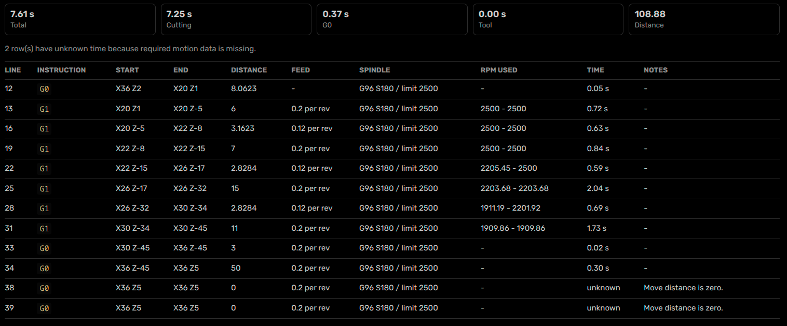

# KAIJU.NC

KAIJU.NC is the world’s first kaiju-themed Visual Studio Code extension for numerical control programming. 

Developed for Fanuc-style G-code and macro-heavy machining, it turns Visual Studio Code into a command center for machining development. Syntax highlighting, diagnostics, visualization, motion analysis, and macro inspection tools designed for engineering beast mode programs.

## KAIJU Highlighting

KAIJU.NC highlights common CNC program elements to help you lock on to your target:

- Program numbers, such as `O1000`
- Block numbers, such as `N100`
- G-codes and M-codes
- Axis and address words, including `X`, `Y`, `Z`, `U`, `V`, `W`, `A`, `B`, `C`, `I`, `J`, `K`, `R`, `F`, `S`, `T`, `H`, `L`, `P`, `Q`
- Macro variables, such as `#100`, `#500`, and named-style macro references
- Macro logic keywords, including `IF`, `THEN`, `WHILE`, `DO`, `END`, `GOTO`
- Math and comparison operators, including `EQ`, `NE`, `GT`, `GE`, `LT`, `LE`, `SIN`, `COS`, `SQRT`, `ABS`, `ROUND`, `FIX`, `FUP`
- Gutter markers that show which tool is active in each section of the program

Fanuc-style parenthesis comments are highlighted, such as `(ROUGHING PASS)`.

Special comment styles are also recognized:

- `(- SECTION COMMENT)`
- `(/ META COMMENT)`
- `(MAIN COMMENT [SUBCOMMENT])`

### In-Editor Example


## KAIJU Alias

`KAIJU Alias` makes macro-heavy programs easier to read by temporarily converting numbered macro variables into readable aliases.

* Command: `KAIJU Alias`
* Shortcut: `Ctrl+Alt+A`

The command scans setup comments before the first executable `G` or `M` code.

Standalone alias notes:

```gcode
(#140 = FINISH ALLOWANCE DIA)
(#141 = ROUGHING FEED)
```

Inline assignment comments:

```gcode
#140 = 0.20 (FINISH ALLOWANCE DIA)
#141 = 0.30 (ROUGHING FEED)
```

When activated, KAIJU Alias toggles numeric macros into readable names:

Before
```gcode
G1 X[10.00 + #140] F#141

```
After
```gcode
G1 X[10.00 + #FINISH_ALLOWANCE_DIA] F#ROUGHING_FEED
```

Run the command again to restore the original numeric macros.

Alias names are generated automatically by converting comment text into lowercase underscore-separated names.


## KAIJU Reconstructor


`KAIJU Reconstructor` is the NC formatting and cleanup command for KAIJU.NC. It normalizes spacing, repairs common layout issues, formats decimal values, and can optionally normalize tool codes.

Named alias macros such as `#finish_allowance` are preserved during formatting.

* Command: `KAIJU Reconstructor`
* Shortcut: `Ctrl+Alt+R`

Before:
```gcode
g1x1.z-2.5f.2
T9
T606
```
After:
```gcode
G01 X1.000 Z-2.500 F0.200
T09
T0606
```

## KAIJU Vision

`KAIJU Vision` opens a live 2D toolpath preview for the active NC program or selected section.

Vision projects sampled `G0`, `G1`, `G2`, and `G3` motion onto `X-Z`, `X-Y`, or `Z-Y` planes with direction-aware toolpaths, endpoint labeling, and machine-position visualization.

* Command: `KAIJU Vision`
* Shortcut: `Ctrl+Alt+V`

Vision walks the active document before drawing so that modal state, macro assignments, feeds, and arc context are resolved before preview generation begins.

### In-Editor Example



## KAIJU Orphan Killer

`KAIJU Orphan Killer` hunts down and kills orphaned macro variables and unresolved macro usage inside the active NC document.

It helps expose hidden mistakes, dead setup values, and missing variables before they turn into production issues.

* Command: `KAIJU Orphan Killer`
* Shortcut: `Ctrl+Alt+O`

The inspection reports:

* Undefined macro usage
* Unused macro definitions

Example:

```gcode id="50zy1w"
#100 = 1.0
#101 = 2.0

G1 X#100 Z#150
```

KAIJU Orphan Killer would report:

```text id="d4k8cl"
Undefined macro usage:
#150

Unused macro definitions:
#101
```

Macro-like text inside comments and protected angle-bracket ranges is ignored automatically. Configured macro ranges can also be excluded from inspection with `kaijuNC.orphanKiller.ignoredMacros`.

### In-Editor Example


## KAIJU Decomposition

`KAIJU Decomposition` tears apart macro-heavy NC programs and generates a temporary flattened inspection copy for analysis.

Built to dissect dense production code, it tracks macro assignments, resolves expressions, and strips away resolved macro logic to expose the underlying motion path more clearly.

* Command: `KAIJU Decomposition`
* Shortcut: `Ctrl+Alt+D`

The generated output is automatically formatted with KAIJU Reconstructor and includes `KAIJU flow` comments where jumps, conditionals, and loops affected the decomposed path.

When required values cannot be resolved automatically, KAIJU prompts for manual numeric input and records those assumptions in the generated file.

Decomposed output can also be inspected directly with `KAIJU Vision`, making it easier to visualize complex macro-generated toolpaths.

## KAIJU Sense

`KAIJU Sense` is the quick diagnostic system for KAIJU.NC.

Hover over explicit `G0`, `G1`, `G2`, and `G3` moves to inspect motion geometry, cutting data, timing estimates, spindle state, and modal information directly inside the editor.

Kaiju Sense exposes motion behavior, macro logic, and assists identifying weaknesses in your NC code.

Sense can display:

* Start and end coordinates
* Axis deltas
* Path length
* Linear move angle
* Arc direction, radius, sweep, center, and endpoint deltas
* Estimated motion time
* Feed and spindle state
* RPM range during CSS cutting

Sense also includes macro-assist features for advanced NC workflows:

* Hover lookup for macro variables
* Alias-aware macro inspection
* Bracket expression highlighting
* Address-aware macro expression parsing

Example:

```gcode id="6dqv4n"
#FINISH_ALLOWANCE_DIA = 0.20

G1 X[#FINISH_ALLOWANCE_DIA + 1.00]
Z[#FINISH_Z - 0.50]
F#ROUGHING_FEED
```
KAIJU Sense walks the active document to resolve modal state, spindle behavior, feed mode, CSS conditions, and previous machine position before generating hover analysis.

### In-Editor Example 

#### G01


#### Macro


## KAIJU Chronoblade

`KAIJU Chronoblade` cuts through wasted motion and expose the inefficiences hiding inside large NC programs.

Chronoblade opens a cycle-time analysis panel where it breaks down machine motion to help identify where cycle time is used.

* Command: `KAIJU Chronoblade`
* Shortcut: `Ctrl+Alt+C`

Chronoblade reports:

* Motion timing
* Tool-change timing
* Start and end positions
* Feed and spindle state
* RPM range during CSS cutting
* Estimated cycle contribution by operation

For CSS cutting, KAIJU.NC samples along the motion path so RPM clamp conditions from `G50` and diameter changes are reflected in the estimated timing output.

### In-Editor Example



## KAIJU Alert

KAIJU.NC includes live diagnostics for common NC patterns that can lead to ambiguous, misleading, or dangerous code.

The inspection system can detect:

* Missing macro-expression brackets
* Misplaced address words inside expressions
* Suspicious motion values without decimal points

Example:

```gcode id="hdtlyu"
G1 X[#PART_OD + #FINISH_ALLOWANCE
```

```gcode id="2njr1h"
G01 U4.000 [F#121 * 0.600]
```

Corrected:

```gcode id="8qd9q9"
G01 U4.000 F[#121 * 0.600]
```

Before:

```gcode id="y85r7x"
G1 X100 Z-20 F5
```

After:

```gcode id="61g7g8"
G1 X100. Z-20. F5.
```

## Supported File Types

Supports common NC and G-code file extensions
.nc, .cnc, .tap, .gcode, .gco, .gc, .ngc, .ncc, .eia, .iso, .min, .mpf, .spf, .dnc, .sub

## Example File

The repository includes a showcase program at `examples/kaiju-showcase.nc`.

Use it to try the main extension tools:

- Hover over setup macros such as `#100`, `#104`, or `#500` to see macro definition lookup
- Run `KAIJU Alias` to toggle numbered macros into readable names by right-clicking in the editor or using `Ctrl+Alt+A`
- Run `KAIJU Reconstructor` on the marked `FIX THIS AREA` section by right-clicking in the editor or using `Ctrl+Alt+R`
- Run `KAIJU Orphan Killer` to find the deliberately unused and undefined macros near the bottom by right-clicking in the editor or using `Ctrl+Alt+O`
- Hover over `G00`, `G01`, and `G02` moves to try `KAIJU Sense` geometry and timing hovers
- Select one operation and run `KAIJU Vision` with `Ctrl+Alt+V` to preview that section's path
- Run `KAIJU Chronoblade` with `Ctrl+Alt+C` to compare motion and tool-change timing rows
- Run `KAIJU Decomposition` with `Ctrl+Alt+D` to inspect a temporary flattened version of the macro loop
- Look at the marked alert demo lines to see missing-bracket and missing-decimal warnings

## Important Safety Note

This extension provides editor assistance only. It does not simulate toolpaths, verify machine state, check collisions, validate setup safety, or guarantee that a CNC program is safe to run.

Always verify CNC programs using proper simulation, machine checks, dry runs, and your shop's approved procedures before running code on a machine.

## License

MIT
