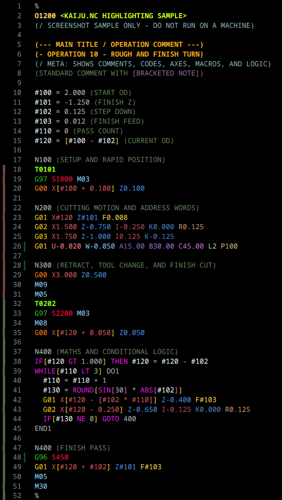
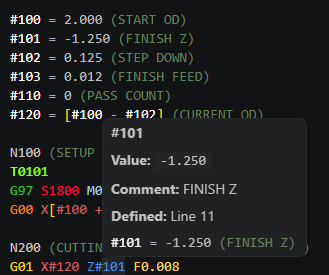
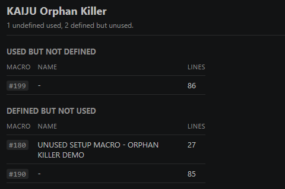
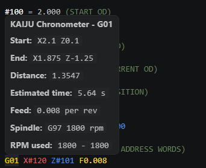

# KAIJU.NC

KAIJU.NC is a Visual Studio Code extension for working with `.nc` files and other common CNC program formats. It provides syntax highlighting, warnings, automatic formatting, and basic diagnostic tools for Fanuc-style G-code and macro programming.

The extension is designed around improving readability, and assisting with problem identification, especially for macro-heavy programs.

## Features

### Highlighting

KAIJU.NC highlights common CNC program elements, including:

- Program numbers, such as `O1000`
- Block numbers, such as `N100`
- G-codes and M-codes
- Rapid and cutting motion codes
- Axis and address words, including `X`, `Y`, `Z`, `U`, `V`, `W`, `A`, `B`, `C`, `I`, `J`, `K`, `R`, `F`, `S`, `T`, `L`, `P`, and `Q`
- Macro variables, such as `#100`, `#500`, and named-style macro references
- Macro logic keywords, including `IF`, `THEN`, `WHILE`, `DO`, `END`, and `GOTO`
- Math and comparison operators, including `EQ`, `NE`, `GT`, `GE`, `LT`, `LE`, `SIN`, `COS`, `SQRT`, `ABS`, `ROUND`, `FIX`, and `FUP`
- Gutter markers that show which tool is active in each section of the program

Fanuc-style parenthesis comments are highlighted:

```gcode
(ROUGHING PASS)
```

Special comment styles are also recognized:

```gcode
(- SECTION COMMENT)
(/ META COMMENT)
(ROUGHING [CHECK OFFSET])
```



### Macro-Assist

KAIJU.NC includes lightweight macro editing tools:

- Hover lookup for macro variables
- Macro alias support for making common variables easier to read
- Bracket expression highlighting that visually ties expressions back to their address word

Example:

```gcode
#140 = 0.20 (FINISH ALLOWANCE DIA)

G1 X[#140 + 1.] Z[#101 - 0.5] F[#130]
```




### KAIJU Alias

`KAIJU Alias` makes macro-heavy programs easier to read by temporarily converting numbered macro variables into readable names.

Activate from the right-click context menu, or by using the shortcut:

```text
Ctrl+Alt+A
```

It looks for macro setup comments before the first executable `G` or `M` code. Comments can be written either as a standalone alias note:

```gcode
(#140 = FINISH ALLOWANCE DIA)
(#141 = ROUGHING FEED)
```

Or as an inline assignment comment:

```gcode
#140 = 0.20 (FINISH ALLOWANCE DIA)
#141 = 0.30 (ROUGHING FEED)
```

When you run `KAIJU Alias`, the rest of the document is toggled between numbered macro variables and readable aliases:

| Before | After |
| --- | --- |
| `G1 X[#140 + 1.] F#141` | `G1 X[#finish_allowance_dia + 1.] F#roughing_feed` |

Run `KAIJU Alias` again to toggle those aliases back to the original numeric macros.

Alias names are generated from the comment text by lowercasing it and replacing spaces or punctuation with underscores. The original setup lines are protected so the source comments remain usable as the alias map.

### KAIJU Reconstructor

`KAIJU Reconstructor` is the document formatting command for NC programs. It normalizes spacing, cleans up common code layout issues, formats configured decimal values, and can optionally normalize tool codes.

Available command:

```text
KAIJU Reconstructor
```

Default shortcut:

```text
Ctrl+Alt+R
```

Examples of the kinds of cleanup it performs:

| Before | After |
| --- | --- |
| `g1x1.z-2.5f.2` | `G01 X1.000 Z-2.500 F0.200` |
| `T606` | `T0606` |

The command opens an options picker before formatting. The default decimal-place count and semicolon behavior can be controlled from VS Code Settings.

### KAIJU Orphan Killer

`KAIJU Orphan Killer` opens a side panel that inspects macro variable usage in the current NC document.

Default shortcut:

```text
Ctrl+Alt+O
```

It reports two kinds of macro issues:

- Undefined uses: macro variables that are referenced but never assigned in the file
- Unused definitions: macro variables that are assigned but never referenced later in the file

Example:

```gcode
#100 = 1.0
#101 = 2.0

G1 X#100 Z#150
```

`KAIJU Orphan Killer` would report:

- `#150` as an undefined use
- `#101` as a defined but unused macro

The inspection ignores macro-looking text inside comments and protected angle-bracket ranges, so setup notes and display strings do not pollute the report.





### KAIJU Chronometer

`KAIJU Chronometer` estimates cutting time when you hover over an explicit `G1`, `G2`, or `G3` move.

The hover shows:

- Start coordinates
- End coordinates
- Travel distance
- Estimated time
- Feed and spindle state used for the estimate
- RPM range when constant surface speed is active

Chronometer walks the document up to the hovered line and uses the previous known position, modal feed, spindle mode, RPM, CSS surface speed, and RPM limit.

It supports:

- Fixed RPM using `G97 S...`
- Constant surface speed using `G96 S...`
- RPM limits from `G50 S...` or `D...`
- Feed-per-rev timing using `F * RPM`
- Feed-per-minute timing when `G94` is active
- Feed-per-rev timing when `G95` is active
- X-as-diameter lathe mode by default

For CSS moves, Chronometer samples along the move so a cut that crosses into the RPM limiter is estimated with the clamp taken into account.

This is an editor estimate only. It does not simulate acceleration, exact controller lookahead, dwell, tool changes, spindle ramp-up, machine limits, or canned cycle behavior.



### Code Alerts

KAIJU.NC provides lightweight warnings for patterns that can make NC programs harder to read or easier to misinterpret.

It can flag missing macro-expression brackets:

```gcode
G1 X[#100 + #101
```

And missing decimal points on motion-related numeric values:

| Before | After |
| --- | --- |
| `G1 X100 Z-20 F5` | `G1 X100. Z-20. F5.` |

## Supported File Types

KAIJU.NC registers support for the following file extensions:
`.nc`,`.cnc`, `.tap`, `.gcode`, `.gco`, `.gc`, `.ngc`, `.ncc`, `.eia`, `.iso`, `.min`, `.mpf`, `.spf`, `.dnc`, `.sub`

## Example File

The repository includes a showcase program at `examples/kaiju-showcase.nc`.

Use it to try the main extension tools:

- Hover over setup macros such as `#100`, `#104`, or `#500` to see macro definition lookup
- Run `KAIJU Alias` to toggle numbered macros into readable names by right-clicking in the editor or using `Ctrl+Alt+A`
- Run `KAIJU Reconstructor` on the marked `FIX THIS AREA` section by right-clicking in the editor or using `Ctrl+Alt+R`
- Run `KAIJU Orphan Killer` to find the deliberately unused and undefined macros near the bottom by right-clicking in the editor or using `Ctrl+Alt+O`
- Look at the marked alert demo lines to see missing-bracket and missing-decimal warnings

## Important Safety Note

This extension provides editor assistance only. It does not simulate toolpaths, verify machine state, check collisions, validate setup safety, or guarantee that a CNC program is safe to run.

Always verify CNC programs using proper simulation, machine checks, dry runs, and your shop's approved procedures before running code on a machine.

## License

MIT
