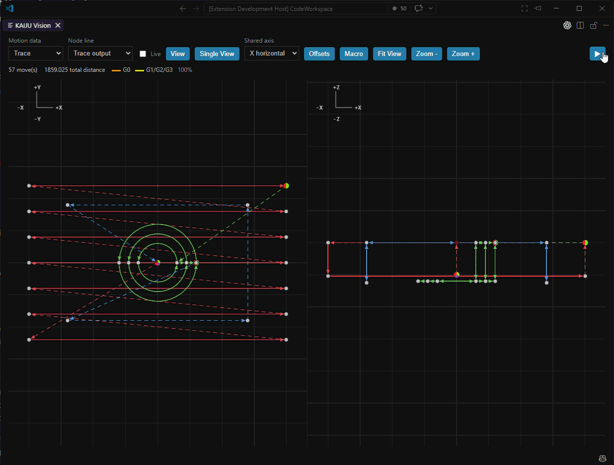
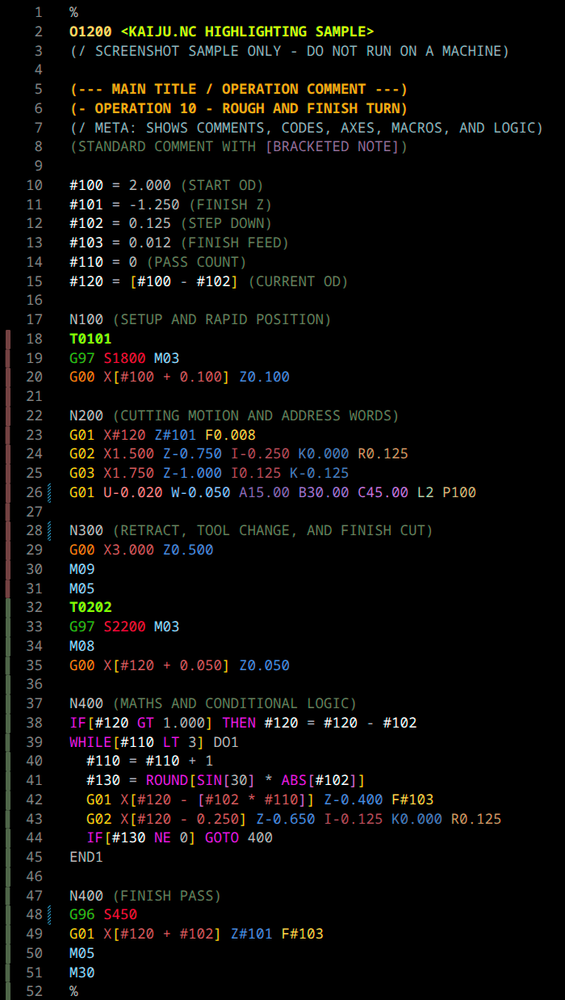
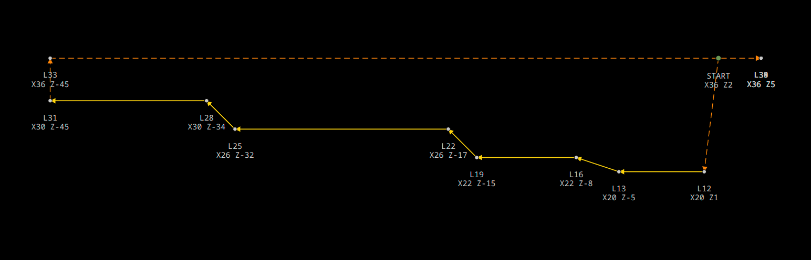
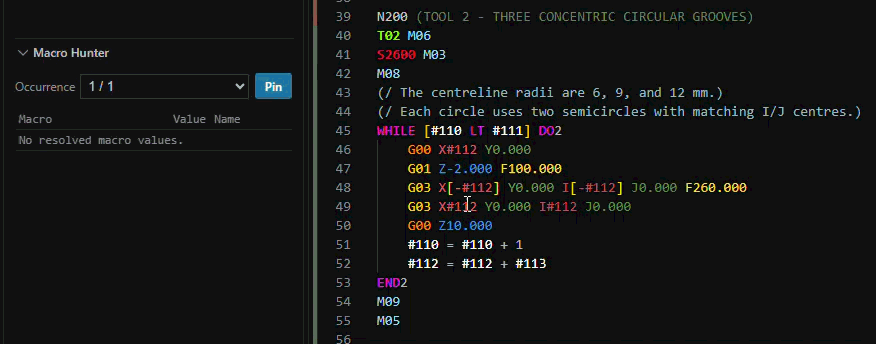
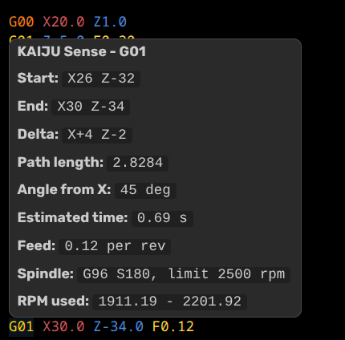
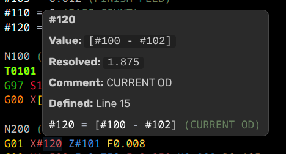

# KAIJU.NC

KAIJU.NC is the world’s first kaiju-themed Visual Studio Code extension for numerical control programming.
Built for Fanuc-style G-code and macro-heavy machining, KAIJU.NC turns Visual Studio Code into a command center for G-code: understand the program, hunt down problems, dissect its motion, and push the machine to its limits.
Syntax highlighting, diagnostics, visualization, motion analysis, and macro inspection tools, all purpose-built for engineering beast-mode programs.

  

# KAIJU Philosophy

KAIJU.NC is built for creating and finishing NC programs by hand, with a focus on parametric programs with loops and macro variables. It grew out of work where CAM software was a poor fit and I needed a better way to edit, inspect, and check the code as it changed. I couldn’t find a tool that brought those needs together, so I built KAIJU.NC. 

KAIJU.NC isn’t intended as a replacement for CAM. Instead by exposing loops, macro values, and toolpaths to the user, it makes errors easier to find and programs easier to optimize when working directly with NC code.

# KAIJU Tools

- Syntax and editor colours
- Vision — toolpath visualization
- Chronoblade — cycle time estimates
- Decomposition — program flow inspection
- Sense — contextual data and tooltips
- Macro Hunter — macro value tracking
- Alias — named macro variables
- Orphan Killer — unresolved and unused macros
- Alert — diagnostics and error detection
- Reconstructor — automatic formatting
- Rangefinder — selection tool
- Machine Mode and G-code Profiles - tailor KAIJU.NC to your machine

For in-depth explanations of all the tools, including example code, open KAIJU Codex from the editor context menu or the Command Palette.

Some highlights as follows:

## Syntax Colouring

KAIJU.NC highlights common program elements

- Program numbers, such as `O1000`
- Block numbers, such as `N100`
- G-codes and M-codes
- Axis and address words, including `X`, `Y`, `Z`, `U`, `V`, `W`, `A`, `B`, `C`, `I`, `J`, `K`, `R`, `F`, `S`, `T`, `H`, `L`, `P`, `Q`
- Macro variables, such as `#100`, `#500`, and named-style macro references
- Macro logic keywords, including `IF`, `THEN`, `WHILE`, `DO`, `END`, `GOTO`
- Math and comparison operators, including `EQ`, `NE`, `GT`, `GE`, `LT`, `LE`, `SIN`, `COS`, `SQRT`, `ABS`, `ROUND`, `FIX`, `FUP`
- Gutter markers that show which tool is active in each section of the program

## Vision

A loop may contain one motion line and produce dozens of passes. Vision shows those executed paths, with tool colours, direction, depth, and motion details you can inspect. Switch to Dual View or step through playback to see how the shape builds.

  

  

## Macro Hunter

Pick a line inside a loop and see every time it executes, with the macro values resolved for each occurrence. Follow one variable from pass to pass, or pin the line while you investigate the rest of the program.

  

## Sense

Hover over a macro or motion line to see its value and context where you’re working. The cursor status follows the active modal state, so you can check what applies at a particular line without tracing back through the file yourself.

  

  

## Supported File Types

Supports common NC and G-code file extensions
.nc, .cnc, .tap, .gcode, .gco, .gc, .ngc, .ncc, .eia, .iso, .min, .mpf, .spf, .dnc, .sub

## Important Safety Note

This extension provides editor assistance only. It does not simulate toolpaths, verify machine state, check collisions, validate setup safety, or guarantee that a CNC program is safe to run.

Always verify CNC programs using proper simulation, machine checks, dry runs, and your shop's approved procedures before running code on a machine.

## License

MIT
