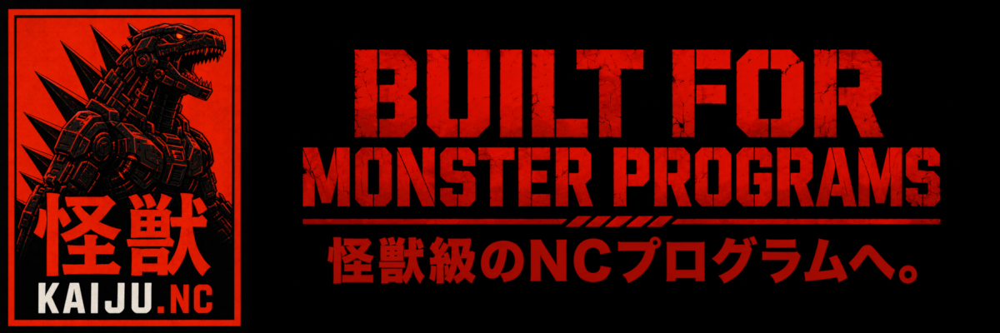

# KAIJU Codex

## Examples

Click a program to open it in the editor. Each example includes comments explaining what to try, which settings to use, and what to look for.

- [Reconstructor](../examples/01-reconstructor.nc) - Try formatting untidy code.
- [Diagnostics and Orphan Killer](../examples/02-diagnostics-and-orphan-killer.nc) - Find errors and follow the suggested fixes.
- [Syntax gallery](../examples/03-syntax-gallery.nc) - Explore comments, addresses, expressions, and control-flow highlighting.
- [Vision and Chronoblade](../examples/04-vision-and-chronoblade.nc) - Inspect a rounded plate, repeated depth passes, and cycle-time estimates.
- [C axis and polar interpolation](../examples/05-c-axis-and-polar.nc) - Inspect full turns, a spiral, retained angles, and a polar face path.
- [Macros, Sense, Macro Hunter, and Alias](../examples/06-macros-sense-hunter-and-alias.nc) - Try readable macro names, hovers, and loop-occurrence histories.
- [Showcase](../examples/07-showcase.nc) - View a complete three-tool plate program with changing macro loops in Vision Trace and Play.

## Tools

- [Vision — inspect toolpaths, loops, and playback](vision.md)
- [Chronoblade — estimate cycle time and compare program sections](chronoblade.md)
- [Decomposition — expand the executed path into readable G-code](decomposition.md)
- [Sense — inspect motion, macros, and modal state at the cursor](sense.md)
- [Macro Hunter — follow macro values through loop occurrences](macro-hunter.md)
- [Alias — toggle between numbered macros and readable names](alias.md)
- [Orphan Killer — find undefined uses and unused definitions](orphan-killer.md)
- [Alerts — inspect suspicious code and static diagnostics](alerts.md)
- [Syntax and editor colours — identify G-code token types](syntax.md)
- [Reconstructor — format G-code presentation](reconstructor.md)
- [Rangefinder — select tool and N-label ranges](rangefinder.md)
- [Machine Mode and G-code Profiles — set machine and controller meanings](machine-mode.md)

## Advanced

- [Conditionals and branches — understand executed IF / THEN / ELSE paths](conditionals.md)
