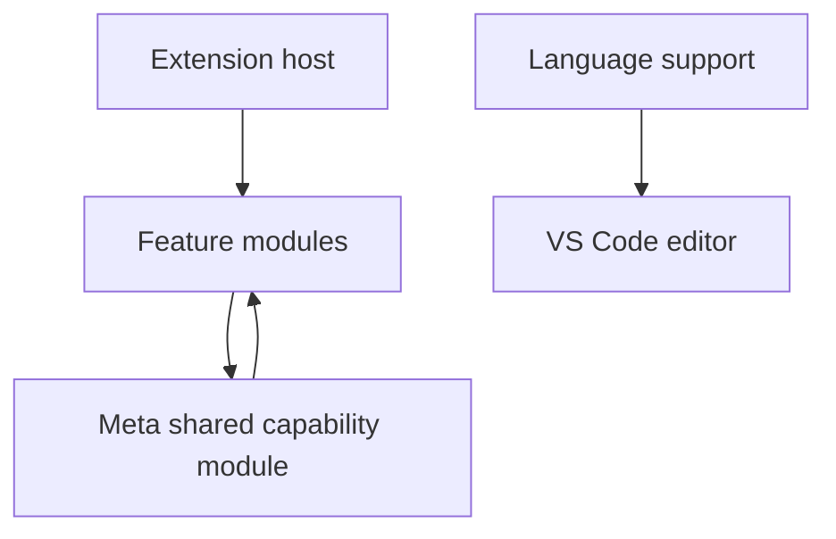

# KAIJU.NC Module Map

This folder documents the intended ownership of KAIJU.NC. It complements
[`MODULE_DEPENDENCIES.md`](../MODULE_DEPENDENCIES.md): that file answers
"what currently imports what"; these files answer "where should this behavior
live, and what should reuse it?"

| Module | Owns | Main shared connections |
| --- | --- | --- |
| [Extension host](extension-host.md) | Activation and registration | Every registered module |
| [Meta](meta.md) | Shared non-UI interpretation, models, and helpers | Used by feature modules |
| [Data access contracts](data-access.md) | Which shared API to call and which returned fields to present | Every feature consumer |
| [Machine Mode](kaiju-machine-mode.md) | Profile commands, custom keybinding editor, and right-side configuration status | Machine state, dialects, Alias state |
| [Trace](kaiju-trace.md) | Passive execution-trace health status | Execution trace, Sense |
| [Language support](language-support.md) | G-code language declaration and token scopes | VS Code editor presentation |
| [Alert](kaiju-alert.md) | Static editor diagnostics | Text ranges, Alias state |
| [Alias](kaiju-alias.md) | Alias editing and mode state | Macro engine, text ranges |
| [Chronoblade](kaiju-chronoblade.md) | Cycle-time report | Motion engine, execution trace, Decomposition line mapping, machine mode |
| [Decomposition](kaiju-decomposition.md) | Readable execution trace | Macro engine, formatter, text ranges |
| [Orphan Killer](kaiju-orphan-killer.md) | Macro definition/reference report | Macro engine, text ranges |
| [Quick Toggles](kaiju-quick-toggles.md) | Context-menu switches for existing settings | Warpaint and Alert settings |
| [Rangefinder](kaiju-rangefinder.md) | Tool/N-label selection | Tool model, text ranges |
| [Reconstructor](kaiju-reconstructor.md) | Document formatting | Its command and options files |
| [Sense](kaiju-sense.md) | Live editor hovers, decorations, cursor status | Motion, macro, tool, and text helpers |
| [Vision](kaiju-vision.md) | Motion inspection report and renderer | Motion engine, execution trace, Decomposition line mapping, machine mode |
| [Warpaint](kaiju-warpaint.md) | Per-document N-section decoration and editor | Tool model, Rangefinder N-label helper |

## How to route a change

- A new calculation or parser needed by multiple features belongs in the
  appropriate part of [Meta](meta.md), not in a webview or editor decoration.
- A new presentation of an existing result belongs in the requesting feature.
- Before scanning source, interpreting a word, or executing control flow, check
  [Data access contracts](data-access.md) for the existing shared read model.
- A user setting stays beside the feature that owns its behavior. A quick
  toggle may expose that setting, but it does not own the behavior it toggles.
- A grammar/token color change belongs in [Language support](language-support.md),
  not in an extension-host feature.

When unsure, follow the narrowest existing owner first. Do not infer a shared
capability from a one-off need.
